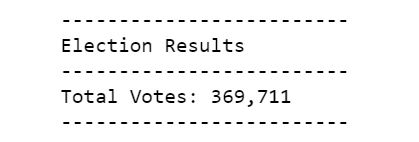
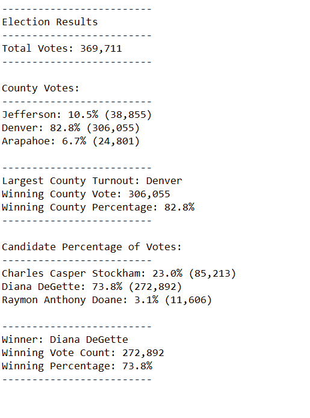

# PyPoll_challenge

## Deliverable 1

### Candidate Results

### Total Votes

### County Results

## Deliverable 2

### Txt file

## Deliverable 3

### Purpose

Provide a written analysis of the election audit for the election commission of the state of Colarado. The audits purpose is to showcase the reults of all the candidates and the 3 counties for which they were the contestants. The audits provided the total votes cast in each county as well as the percentages. Futhermore it gives data on each candidates votes recieved and relevant pecentages.

### Results

1. Total Votes:369,711
2. Votes by County
* Jefferson: 10.5% (38,855)
* Denver: 82.8% (306,055)
* Arapahoe: 6.7% (24,801)
3. Votes by Candidate
* Charles Casper Stockham: 23.0% (85,213)
* Diana DeGette: 73.8% (272,892)
* Raymon Anthony Doane: 3.1% (11,606)
4 Largest County Turnout: Denver
5 Winner Results
* Winner: Diana DeGette
* Winning Vote Count: 272,892
* Winning Percentage: 73.8%

### Audit Opportunity

The audits code can be augumneted to maybe see f any one candidate on his/her own croses the 50% mark to immediately declare a winnner. The code can also be modified to give  a percentage of the wightage of each county in the electoral county.
